# Cross-Atlantic Price Discovery: XETRA vs BATS

Empirical application of Pascual, Pascual-Fuster & Climent (2006), *"Cross-listing, price discovery and the informativeness of the trading process,"* Journal of Financial Markets, 9(2), 144–161.

The data here pairs **XETRA (Frankfurt, EUR-quoted)** with **Cboe BZX — "US BATS" — (USD-quoted)** for six dual-listed stocks. The two venues only trade simultaneously during the US open, so the analysis is restricted to that overlap window.

---

## What the paper asks

When the same stock trades on two markets — e.g. Tesla on Frankfurt's XETRA and on a US venue like Cboe BZX — which venue leads price discovery during the overlap? Does the European exchange set the price that the US venue follows, or does information flow the other way?

Pascual et al. study NYSE-listed Spanish stocks that also trade on the Spanish SSE and find that, despite NYSE's much larger volume, the SSE contributes 12–30% of price discovery while the NYSE listing has almost no informative trades. They build on Hasbrouck's (1995) information-share framework and separate two sources of cross-market information asymmetry: shocks that originate *from trading* (informed investors choosing where to execute) and shocks that are *trade-unrelated* (public news, macro announcements). Their empirical counterpart is a Vector Error Correction model that explicitly identifies the unexpected, informative component of each venue's order flow.

The key insight is that a market can have high quoting activity and still contribute nothing to price discovery — what matters is whether its *trades* carry information. A pure satellite market has an uninformative trading process: prices there adjust to the dominant venue rather than the other way around.

> "A pure satellite market has an uninformative trading process that cannot shed light on the interpretation of public information."
> — Pascual, Pascual-Fuster & Climent (2006), p. 146

This project replicates the spirit of that question for a different cross-listing pattern: US-headquartered stocks (plus SAP) traded on both XETRA in Frankfurt and Cboe BZX in the US, observed at 30-second resolution.

---

## What this project does

- Loads 30-second OHLCV bars from XETRA (EUR) and Cboe BZX / US BATS (USD) for six dual-listed stocks: Tesla (XETRA: TL0 / BATS: TSLA), Microsoft (MSF / MSFT), Amazon (AMZ / AMZN), NVIDIA (NVD / NVDA), PayPal (2PP / PYPL), and SAP (SAP / SAP).
- Finds the common trading window across all 12 data files (~Oct 31 – Dec 9, 2024) and aligns each series to a complete 30-second timestamp grid.
- Labels bars by trading session: European-only (07:00–12:00 UTC), Pre-US Open (12:00–14:30 UTC), and US Open (14:30–21:00 UTC). Analysis is restricted to the US Open overlap where both venues trade simultaneously.
- Computes mean price deviations (XETRA − BATS) per session.
- Runs ADF stationarity tests on price levels to confirm prices are I(1).
- Tests for cointegration via Engle-Granger (residual ADF) and Johansen trace test, and documents the results honestly — including that Johansen fails to reject H₀ at standard lags for this data.
- Runs Granger causality tests (lag 5 = 2.5 minutes) in both directions for all six pairs.
- Produces scatter plots and smoothed time-series plots of prices and spreads across the full window.
- Fits VAR models (AIC lag selection) on log returns and reports residual correlations and R² by venue.

> **A note on currency.** XETRA prices are in EUR; BATS prices are in USD. The script does not convert to a common currency, so any test or statistic computed on **price levels** (the mean deviation, Engle-Granger, Johansen, Granger on levels) is implicitly absorbing the EUR/USD exchange rate. The **log-return** results in Sections 9–10 are scale-invariant and unaffected by this — they are the primary results of the project; the level-based tests are reported as descriptive complements.

---

## Results

### Mean price deviations (US Open session)

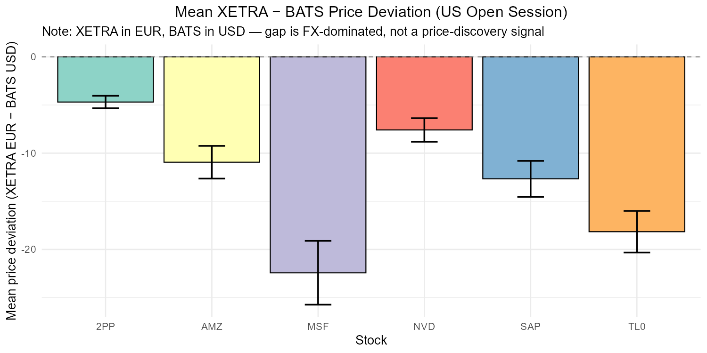

All deviations are negative during the US Open: the EUR-quoted XETRA close is systematically below the USD-quoted BATS close, ranging from about −5 (PayPal) to −22 (Microsoft). Roughly 5–6% of the price level, which is essentially the EUR/USD differential in late 2024 (~$1.05/€). The "deviation" here is therefore **not** a microstructure signal — it is dominated by the unit mismatch. It is shown as a sanity check on the alignment, not as a price-discovery result.

### ADF stationarity tests

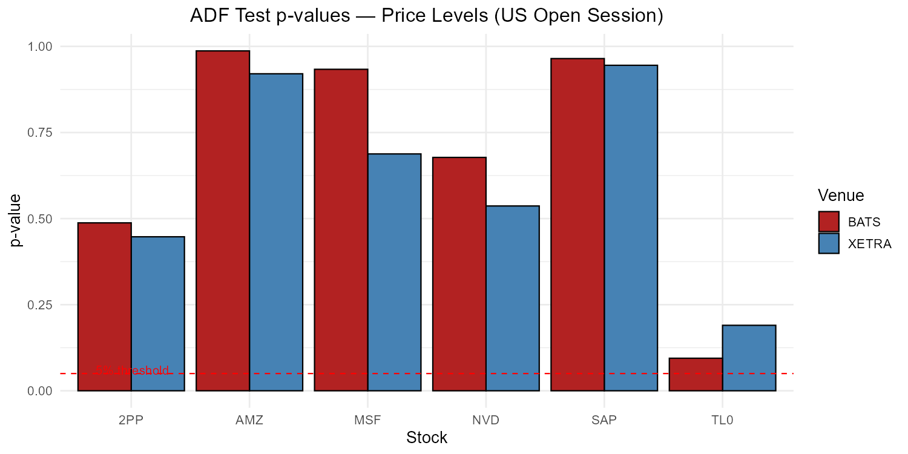

Price levels are non-stationary (high p-values, fail to reject H₀) for all stocks on both venues — confirming I(1) behavior as expected. The analysis then proceeds on log returns.

### Granger causality

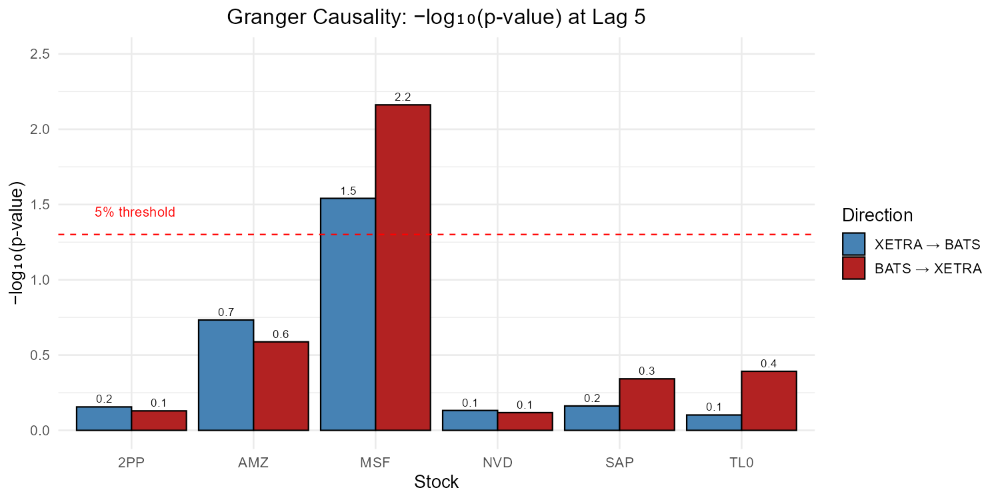

Key findings at lag 5 (= 2.5 minutes), tested on price levels:

| Stock | XETRA → BATS | BATS → XETRA | Interpretation |
|-------|:---:|:---:|----------------|
| MSF (Microsoft) | ✓ p = 0.029 | ✓ p = 0.007 | Bidirectional |
| TL0, NVD, SAP, AMZ, 2PP | — | — | No significant lead |

Microsoft is the only pair with detectable Granger causality on price levels at the 5% level, and it runs in both directions over a 2.5-minute horizon. The remaining five stocks show no significant lead-lag relationship on levels. As above, level-based tests across two currencies should be read carefully — the log-return VAR (Section 9 of the script) is the more reliable view.

### Scatter plots — XETRA vs BATS prices (US Open)

| TL0 | MSF | AMZ |
|:---:|:---:|:---:|
| 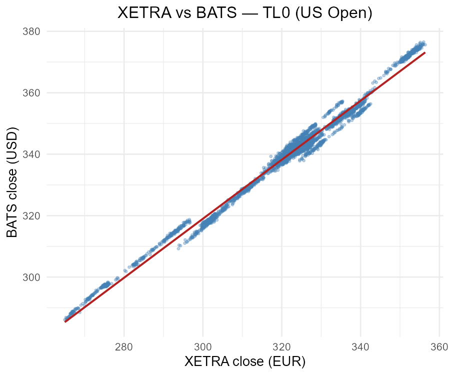 | 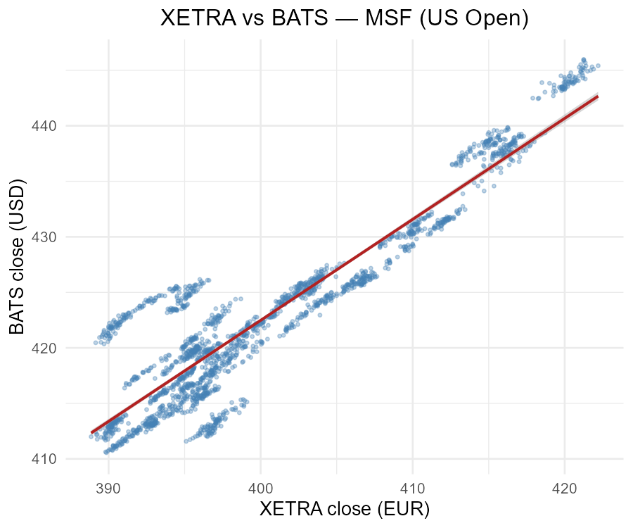 | 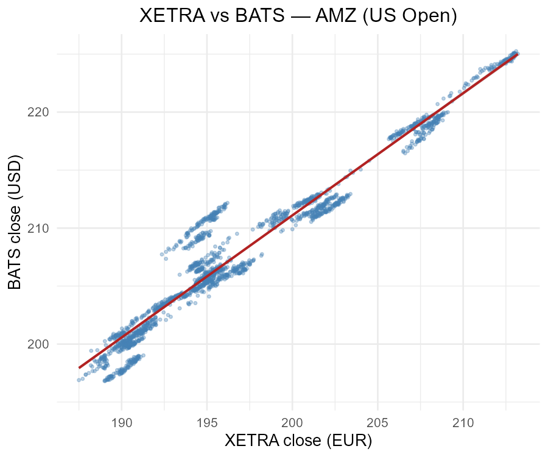 |

| NVD | SAP | 2PP |
|:---:|:---:|:---:|
| 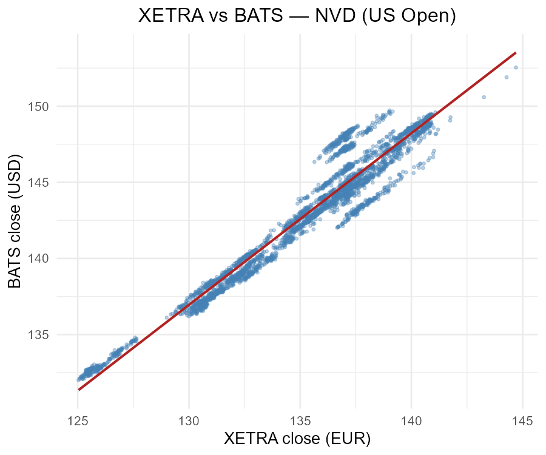 | 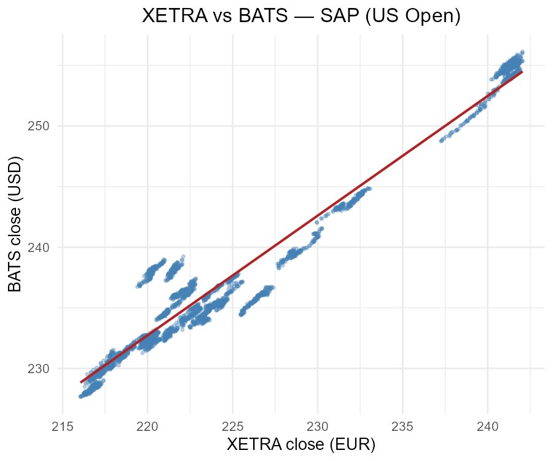 | 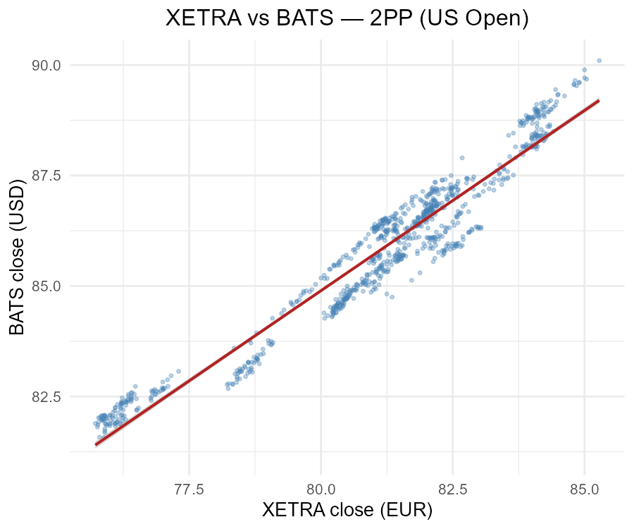 |

Strong linear co-movement during the US Open across all six pairs, consistent with the two venues pricing the same fundamental value (modulo the EUR/USD scale on the y-axis).

### Smoothed time series

| TL0 | MSF | AMZ |
|:---:|:---:|:---:|
| 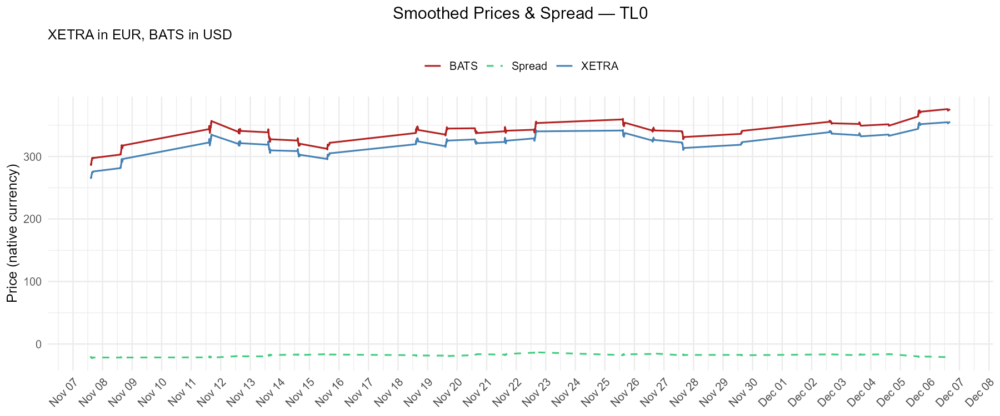 | 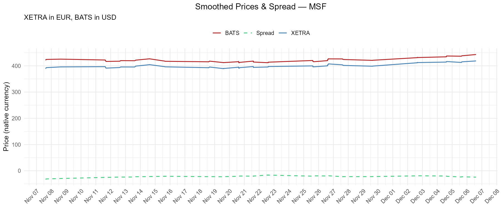 | 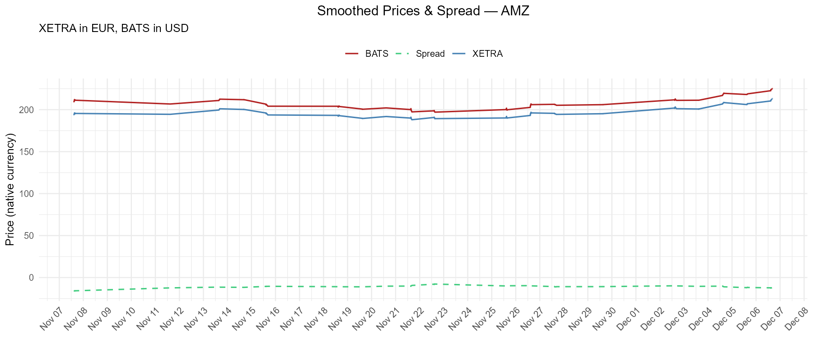 |

| NVD | SAP | 2PP |
|:---:|:---:|:---:|
| 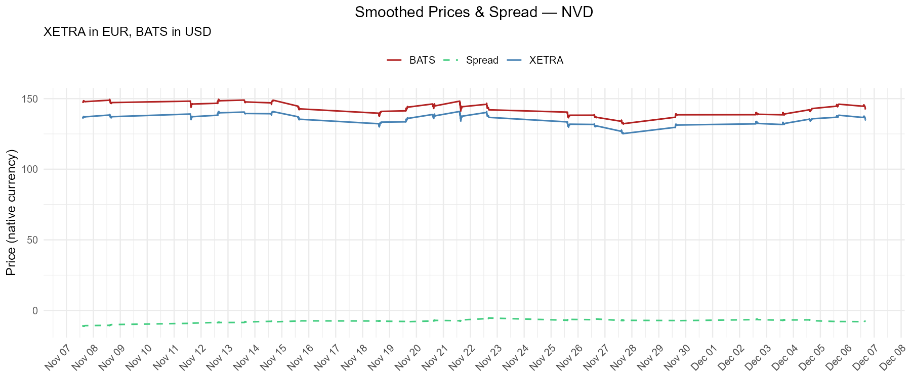 | 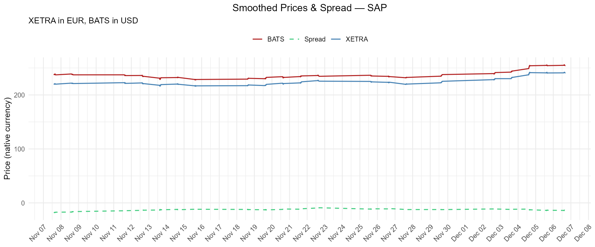 | 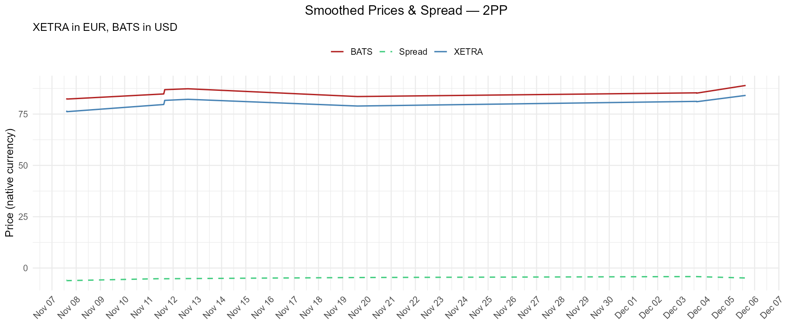 |

Blue is XETRA (EUR), red is BATS (USD), dashed green is the XETRA − BATS gap. The gap level reflects the EUR/USD exchange rate; its short-term variation around that level reflects venue-specific price moves that haven't yet propagated.

### VAR residual correlations and R² by venue

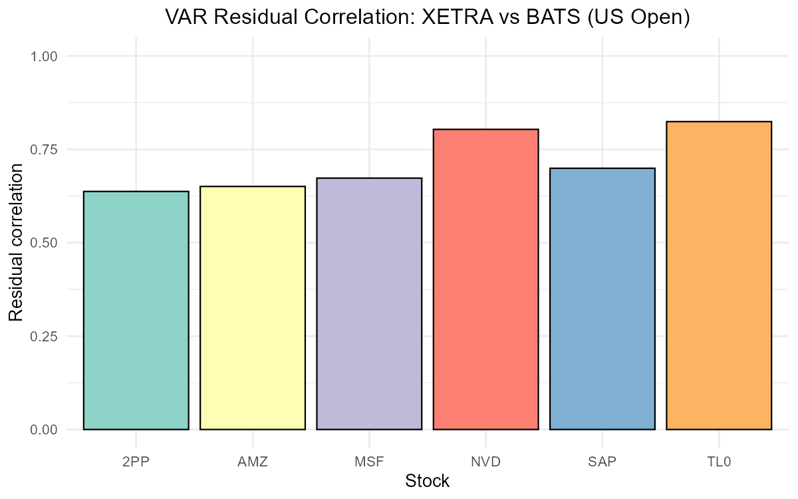

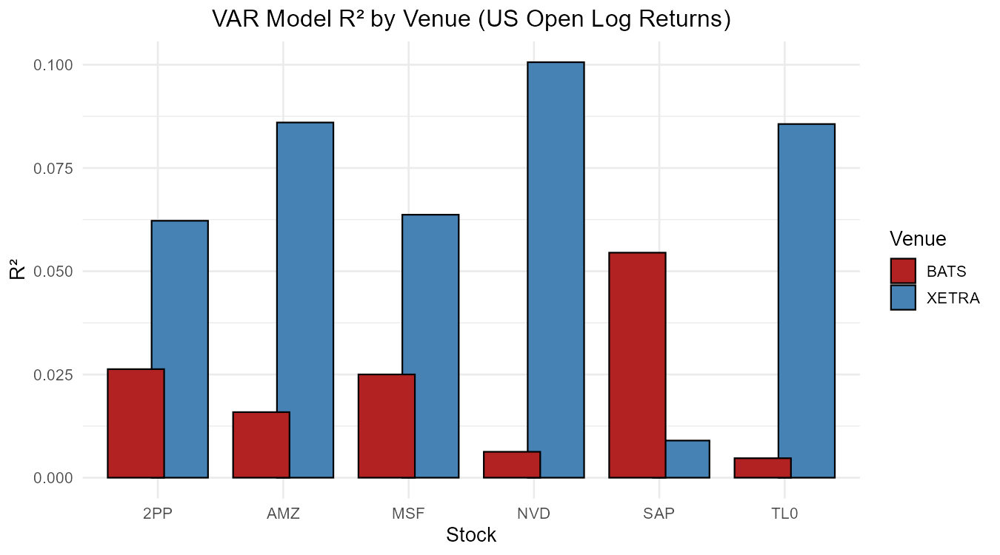

Residual correlations between the two venues' log returns range from ~0.64 (PayPal) to ~0.82 (Tesla, NVIDIA), reflecting how tightly the two listings co-move after controlling for lagged returns. The R² panel shows how much of each venue's current 30-second log return is explained by past cross-venue returns — for SAP the BATS equation has substantially higher R² (≈0.054) than the XETRA equation (≈0.009), meaning XETRA returns help predict BATS returns more than the reverse. NVD and TL0 show the opposite asymmetry, with the XETRA equation more predictable from past cross-venue returns.

---

## Methodology

The analysis follows a two-stage approach grounded in Pascual et al.'s framework.

**Stage 1 — price levels.** XETRA and BATS closing prices are modelled as I(1) processes. The Engle-Granger two-step test regresses BATS on XETRA prices and applies an ADF test to the residuals; stationary residuals indicate cointegration. The Johansen trace test provides a multivariate complement. For 30-second intraday series over a one-month window, the Johansen test fails to reject H₀ (no cointegration) for all six pairs. The Engle-Granger test finds evidence of cointegration for Microsoft (p = 0.022) but not for the other five stocks. These results are consistent with the short observation period and the dominance of microstructure noise at high frequency, which tends to obscure mean-reversion dynamics. They are also, to be transparent, run on series in different currencies: the cointegrating slope absorbs an FX component, so the test is closer to "does an EUR/USD-implicit linear relationship hold?" than to "does a parity relationship hold?".

**Stage 2 — log returns.** The VAR is estimated on log returns Δlog(P), which are stationary by construction and are the primary results of the project:

$$\Delta \log P_t = \sum_{k=1}^{p} A_k \, \Delta \log P_{t-k} + \varepsilon_t$$

where $P_t = (\text{XETRA}_t, \text{BATS}_t)'$, $A_k$ are $2 \times 2$ coefficient matrices, and $\varepsilon_t$ is the residual vector. The lag order $p$ is selected by AIC (search over $p = 1, \ldots, 10$). Granger causality is tested via an F-test on the null that all lags of one venue's returns have zero coefficients in the other venue's equation. Because log returns are scale-invariant, the EUR/USD level mismatch does not contaminate this stage; the only residual FX effect is the small Δlog(EUR/USD) increment, which on 30-second intervals is several orders of magnitude smaller than the underlying stock-return innovation.

---

## Reproducing the results

**Requirements:** R ≥ 4.2. The script installs any missing packages automatically on first run.

```bash
Rscript xetra_bats_price_discovery.R
```

Or open `xetra_bats_price_discovery.R` in RStudio and click **Source**.

All figures are saved to `figures/` and all numeric results are printed to the console.

**Packages used:** `dplyr`, `lubridate`, `ggplot2`, `tseries`, `lmtest`, `vars`, `zoo`, `urca`.

---

## Repository layout

```
xetra-bats-price-discovery/
├── xetra_bats_price_discovery.R   # single end-to-end script
├── README.md
├── .gitignore
├── data/                          # 30-second OHLCV bars (committed)
│   ├── BATS_AMZN, 30S.csv         # Cboe BZX, USD
│   ├── BATS_MSFT, 30S.csv
│   ├── BATS_NVDA, 30S.csv
│   ├── BATS_PYPL, 30S.csv
│   ├── BATS_SAP, 30S.csv
│   ├── BATS_TSLA, 30S.csv
│   ├── XETR_DLY_2PP, 30S.csv      # XETRA Frankfurt, EUR
│   ├── XETR_DLY_AMZ, 30S-2.csv
│   ├── XETR_DLY_MSF, 30S.csv
│   ├── XETR_DLY_NVD, 30S-2.csv
│   ├── XETR_DLY_SAP, 30S.csv
│   └── XETR_DLY_TL0, 30S.csv
└── figures/                       # produced by the script
    ├── mean_price_deviations.png
    ├── adf_tests.png
    ├── granger_causality.png
    ├── scatter_TL0.png, scatter_MSF.png, scatter_AMZ.png,
    │   scatter_NVD.png, scatter_SAP.png, scatter_2PP.png
    ├── timeseries_TL0.png, timeseries_MSF.png, timeseries_AMZ.png,
    │   timeseries_NVD.png, timeseries_SAP.png, timeseries_2PP.png
    ├── residual_correlations.png
    └── r_squared_comparison.png
```

---

## References

- Pascual, R., Pascual-Fuster, B., & Climent, F. (2006). Cross-listing, price discovery and the informativeness of the trading process. *Journal of Financial Markets*, 9(2), 144–161. https://doi.org/10.1016/j.finmar.2006.01.002
- Hasbrouck, J. (1995). One security, many markets: Determining the contributions to price discovery. *Journal of Finance*, 50(4), 1175–1199.
- Harris, F. H., McInish, T. H., Shoesmith, G. L., & Wood, R. A. (1995). Cointegration, error correction, and price discovery on informationally linked security markets. *Journal of Financial and Quantitative Analysis*, 30(4), 563–579.
- Amihud, Y., & Mendelson, H. (1986). Asset pricing and the bid-ask spread. *Journal of Financial Economics*, 17(2), 223–249.
- Data: 30-second OHLCV bars from XETRA (Frankfurt) and Cboe BZX / US BATS, Oct 31 – Dec 9, 2024 (course-provided, WU Wien Market Microstructures).
